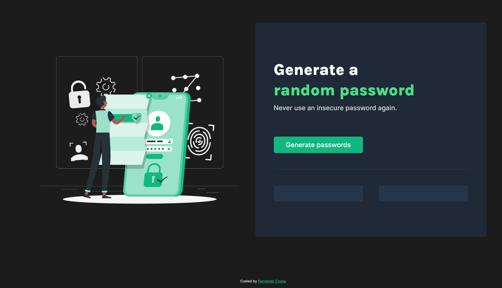

# Scrimba - Random Password challenge

This is my solo project challenge from Scrimba to build a random password generator using HTML, CSS & JavaScript

## Table of contents

- [Overview](#overview)
  - [The challenge](#the-challenge)
  - [Screenshot](#screenshot)
  - [Links](#links)
- [My process](#my-process)
  - [Built with](#built-with)
  - [What I learned](#what-i-learned)
  - [Continued development](#continued-development)
- [Author](#author)

## Overview

### The challenge

Users should be able to:

- Use this website in any screen size
- Generate two random passwords by clicking the 'generate password' button

### Screenshot




### Links

- [My solution](https://github.com/ffernandocosta/random-password)
- [Live version](https://ffernandocosta.github.io/random-password/)

## My process

### Built with

- Semantic HTML5 markup
- CSS custom properties
- Flexbox
- CSS Grid


### What I learned

In this project I learned how to follow a figma design and at the end add my own ideas to it. Learned how to manipulate the DOM using JavaScript. Learned how to generate random number and use a for loop to get random items from an array. Also learned how to use the 'addEventListener' method.

```html
<h1>Some HTML code I'm proud of</h1>
  <div class="grid-area">
                
    <button class="generator-btn">Generate passwords</button>

    <hr>

    <span class="password password-1"></span>

    <span class="password password-2"></span>
  </div>
```
```css
.proud-of-this-css {
  
  @media screen and (min-width: 600px) and (max-width: 1350px) {
    .password {
        grid-column: span 1;
    }

    .generator-btn {
        width: 55%;
        justify-self: center;
    }

}
}
```


## Author

- GitHub - [Fernando Costa](https://github.com/ffernandocosta)